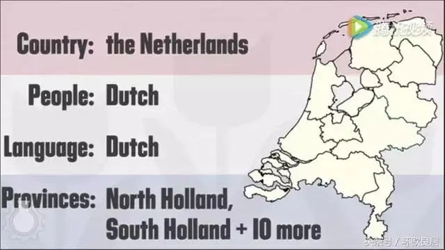

# Weiruish
## Living in a Place
### Describe a person
#### Positive
|Expression|Explanation|Examples or Remarks|
|-----------|-----------|-----------|
#### Neutral
|Expression|Explanation|Examples or Remarks|
|-----------|-----------|-----------|
|digitally savvy|对现代电子、信息化生活十分适应|
#### Negative
|Expression|Explanation|Examples or Remarks|
|-----------|-----------|-----------|
|living in cloud **cuckoo** land||我们常用这个说法来形容一个生活在梦幻世界中的人，异想天开的人。这种人的想法通常非常不现实，其至让人觉得有些可笑。*cuckoo本来指杜鹃鸟*|
### Ego-body
#### Mental
|Expression|Explanation|Examples or Remarks|
|-----------|-----------|-----------|
#### Physical
|Expression|Explanation|Examples or Remarks|
|-----------|-----------|-----------|
|food coma|饭后的疲倦|
|haggard|憔悴的、疲惫的|词源不确定，可能来自古法语faulcon hagard,野鹰，被抓获的猎鹰，来自古英语haga,树篱，篱笆，围栏，词源同haw,hedge.因野鹰的天性狂野，桀骜不驯，被抓获后常绝食而亡，因此引申词义消瘦的，后用为形容人憔悴的。|
### Having a relationship
#### Wanna hookup?
|Expression|Explanation|Examples or Remarks|
|-----------|-----------|-----------|
|love rat|渣男|本词男女通用，表示薄幸郎、负心汉、爱情骗子、大猪蹄子...|
|jerk, dick, cheater, asshole|渣男（有出轨之实）|He's such a jerk/dick/cheater/asshole, can't you tell? 他就是个渣男，这都看不出来吗？|
|playboy, player, two-timer|渣男（有出轨迹象）|For what is worth, Kenny is nothing but a playboy/player/two-timer.别怪我没提醒，肯尼是个花花肠子。|
|douche /duːʃ/ bag |有渣男；变态的含义|douche bag的原意是“冲洗袋”，它同样也可以用来骂“渣男”和“变态”。As long as I never have to date another douche bag again, I could do anything.只要我不必再和渣男约会，我啥都愿意做。|
|bastard |混蛋；渣男|bastard可以表示“杂种；私生子”的意思，在《权力的游戏》中琼·雪诺就被称为bastard。That bastard dumped me after he took advantage of me.那个渣男利用完我就把我甩了。|
|mistress|情妇|Peter had an affair with his boss’s mistress.皮特和他老板的情妇有一腿。|
|paramour /ˈpærəmʊə(r)/|小三儿（情妇，情夫；情人）（相比 mistress 更温和）|He kept you here to be his paramour?他就让你藏这儿当他情妇？|
|kept / fancy woman|被包养的女人|What lead you to the thought of being a kept /fancy woman?是什么让你有被包养的念头？|
#### Housewife & Househusband
|Expression|Explanation|Examples or Remarks|
|-----------|-----------|-----------|
|revamp home|做家务|
|chore|家务|还可以指繁重的活儿|
|go/walk down the aisle|结婚/步入婚姻殿堂|
#### Grocer
|Expression|Explanation|Examples or Remarks|
|-----------|-----------|-----------|
### Buzzword
|Expression|Explanation|Examples or Remarks|
|-----------|-----------|-----------|
|buzzword|流行词汇|
|ad hominem|针对个人的(adj.adv.)| ad hominem insults 人身攻击|
|homophobic, claustrophobic, trypophobic|各种恐惧症|

### Regular Contract
|Expression|Explanation|Examples or Remarks|
|-----------|-----------|-----------|
|Small print|附加条款|

### Social & Market
|Expression|Explanation|Examples or Remarks|
|-----------|-----------|-----------|
|social hierarchy|社会阶层|
|prestige panic|名誉恐惧|过度追求名誉|
|problematic goods|（质量有问题）的商品|
|squalid conditions|恶劣的条件|filthy conditions|
|undercover reporters|卧底记者|

### Netti
|Expression|Explanation|Examples or Remarks|
|-----------|-----------|-----------|
|offset the bad publicity|公关|

### Bad words
#### Horny
|Expression|Explanation|Examples or Remarks|
|-----------|-----------|-----------|
|🍆、🍌|dick|
|knockers|tities|aus Cassie, aus Euphoria|
|touchdown|about to cum or reach orgasm|when moaning in the couch, you shall yell this out|

#### Offensive
|Expression|Explanation|Examples or Remarks|
|-----------|-----------|-----------|
|Eeny-weeny, teeny-weeny, shriveled little short dick man|🤏🐔👨|

### Affection
#### Offensive
|Expression|Explanation|Examples or Remarks|
|-----------|-----------|-----------|
|May-December romance |忘年恋|
### Actions and Performance
|Expression|Explanation|Examples or Remarks|
|-----------|-----------|-----------|
|succeed in academic |学术上成功|十分常用的collocation|
### *Jobs jobs jobs* 👏 -- D. Trump
|Expression|Explanation|Examples or Remarks|
|-----------|-----------|-----------|
|chuck one's job|quit one's job|

### Real-world substance or definition
|Expression|Explanation|Examples or Remarks|
|-----------|-----------|-----------|
|College acceptance rate|大学升学率|注意，美国大学是申请入学|

### Eco eco
|Expression|Explanation|Examples or Remarks|
|-----------|-----------|-----------|
|carbon sink|碳汇集|
### Economy
#### Terms
|Expression|Explanation|Examples or Remarks|
|-----------|-----------|-----------|
|marketability|市场潜力|
|branch|分公司（如银行）|
|lopsided economic relations|极不平衡的经济关系|
|house-hold saving rate|家庭储蓄率|
#### Phenomenon
|Expression|Explanation|Examples or Remarks|
|-----------|-----------|-----------|
|trickle down effect|涓滴效应|指在经济发展过程中并不给予贫困阶层、弱势群体或贫困地区特别的优待，而是由优先发展起来的群体或地区通过消费、就业等方面惠及贫困阶层或地区，带动其发展和富裕，或认为政府财政津贴可经过大企业再陆续流入小企业和消费者之手，从而更好地促进经济增长的理论。|
|reactionary |保守的、反动的|来自法语.原意是向相反的方向和恢复以前的状态.法国大革命时代赋予了政治意义并传入英语.这些人在大革命中反对政治和经济的变革,主张复古,因此是保守的 ,反对社会变革,阻碍社会进步,因此是反动的.和我们理解的反动有点不同.|
## One's behavior

## Do Academics
### Writing
|Expression|Explanation|Examples or Remarks|
|-----------|-----------|-----------|
|paraphrase|论文中的转述|
#### Graph or Applied Writing
|Expression|Explanation|Examples or Remarks|
|-----------|-----------|-----------|
|hit a slump|暴跌|
|underscore| 强调、凸显|The figures underscore the shaky state of the economy.|
|beef up|增加|
|top *(v.)*|占据第一、顶部的位置|India topped a list. = India is the top one of list.|
|mix|组成情况|相当于各种share的pie chart，比如energy consumption mix|
#### Argumentaion etc.
|Expression|Explanation|Examples or Remarks|
|-----------|-----------|-----------|
### Terms
#### General Description
|Expression|Explanation|Examples or Remarks|
|-----------|-----------|-----------|
|statistical fluke|统计侥幸（巧合）|
|viable|可行的|practical, practicable|
|underlie|构成……的基础|**⚠️注意！不能是被动**。例：Intellect underlies the power.才智是权利的基础.|
#### Metaphor
|Expression|Explanation|Examples or Remarks|
|-----------|-----------|-----------|
|smockstack|n.大烟囱 adj.重工业的|因为工厂上会有大烟囱，所以这个词作形容词就可以指重工业的，比如smockstack industries|
#### CS
##### Img/AU/VI
|Expression|Explanation|Examples or Remarks|
|-----------|-----------|-----------|
|vector graphics|矢量图|
|raster graphics|位图|
### High-end expression (nerd version)

|Expression|Explanation|Examples or Remarks|
|-----------|-----------|-----------|
|beckon|开始有发生的迹象、趋势|这个词本来主要的意思是“示意”、“吸引”，另外可以表示“seem to be appealing or inviting”. The divorce beckons.|
|antecedence|先前的事物（前置条件）|Creative thinking is the antecedence of design.|
|by dint of|by means of, 凭借着……|

## Play Politics

|Expression|Explanation|Examples or Remarks|
|-----------|-----------|-----------|
|fiscally conservative|财政上保守的|
|the Oval Office|美国总统的办公地点，坐落于白宫|
|Amnesty International|大赦国际|总部设于英国的国际组织，专事争取释放因信仰问题被关押者，并提倡取消刑讯、废除死刑|
|pernicious|有害的（尤指潜移默化的）|the media's pernicious influence 媒体洗脑|

### CCP Propaganda
|Expression|Explanation|Examples or Remarks|
|-----------|-----------|-----------|
|at the national level|在国家层面上的|
|enhacne cross-regional collaboration|加强跨区域合作|
## Helpful Adj. & Adv
### All about the size *~~of dick~~*
#### Small, a bit
|Expression|Explanation|Examples or Remarks|
|-----------|-----------|-----------|
|a splash of|一点儿|Just **a splash of** milk in my coffee, please.|

## Random Collections
|Expression|Explanation|
|-----------|-----------|
|荷兰||